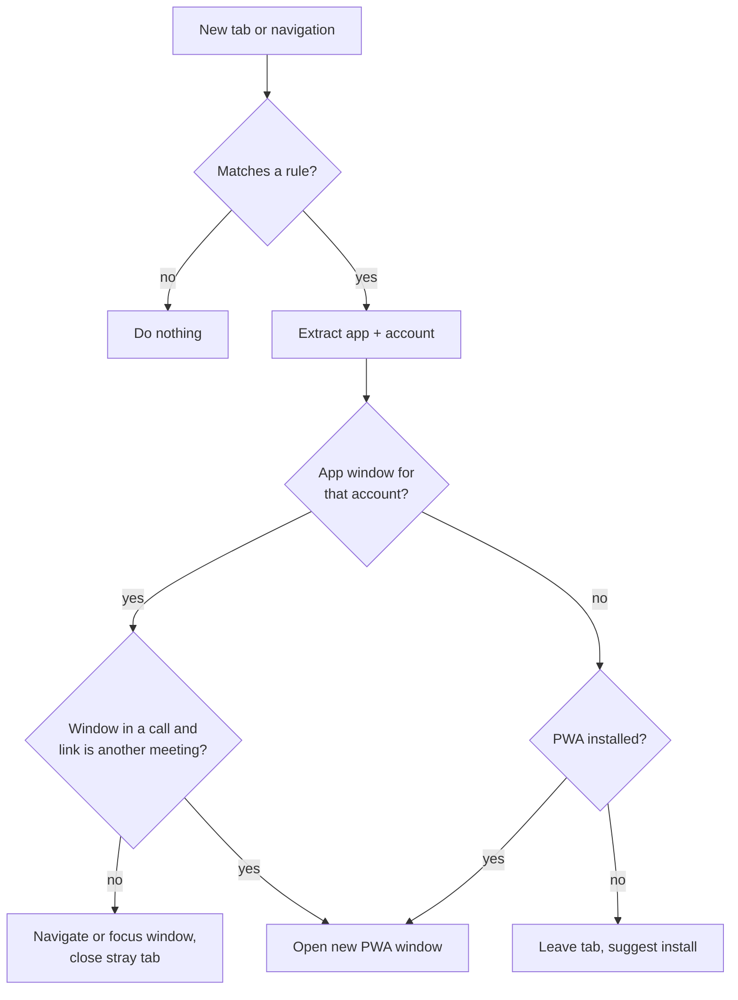

# Dock — v1 Spec: Web App Link Router & Switcher

Sep 22, 2026 · @Someone

## Overview

Dock v1 is a Chrome extension that sends every web-app link to the right installed PWA window, for the right account, and gives one shortcut to find any app window. It needs no separate browser and no account, and nothing leaves the device.

**The problem.** Clicking a Meet link in Gmail, Calendar or Slack usually opens a new browser tab instead of the Meet PWA. After a day of this, users have duplicate Gmail tabs, stray Meet tabs and PWA windows, and they can't tell which is which. Multiple Google accounts make it worse, because nothing tells you whether a window is work or personal.

**Why existing fixes fall short.**

- Chrome's per-app "open supported links" setting only applies to some link sources and doesn't know about accounts.
- The `launch_handler` manifest field (`focus-existing`) is set by the site owner, not by the user.
- Wavebox, Shift and Stack solve this by replacing the browser. Dock keeps the user's real Chrome, extensions and PWAs.

## Goals, non-goals and success metrics

**Goals**

1. A matching link never leaves a stray tab. It lands in the existing app window, or opens the PWA if none is open.
2. Links go to the window for the account the link names.
3. Any app window is two keystrokes away: the shortcut, then type and press Enter.
4. Built-in rules work for Google Workspace apps with no setup.

**Non-goals for v1**

- Links clicked outside Chrome, such as in the Slack desktop app or email clients. This is the v2 desktop helper.
- Browsers other than Chrome and Edge.
- Reading page content such as unread counts or call state beyond what the tab title exposes.
- Sync, accounts, cloud or analytics.

**Success metrics**

| Metric | Target |
| --- | --- |
| Stray tabs per day for matching links | 0 in dogfooding |
| Routing latency, click to focused window | < 300 ms |
| Correct account routed (multi-account users) | ≥ 98% |
| Switcher use | ≥ 5 opens per active user per day |
| Chrome Web Store rating after 100 reviews | ≥ 4.5 |

## Users and core scenarios

The primary user is a knowledge worker who has installed Gmail, Meet and Calendar as PWAs and has two or more Google accounts. Freelancers and consultants who juggle client Workspaces are the sharpest version of this user.

| # | Scenario | Today | With Dock |
| --- | --- | --- | --- |
| S1 | Click a Meet link in a Calendar event | New browser tab | Meet PWA window for that account opens and focuses |
| S2 | Click a Gmail link in a Chrome tab, Gmail PWA already open | Second Gmail tab | Existing Gmail window navigates and focuses; the tab closes |
| S3 | Work Meet link, personal Meet window already open | Opens in the wrong account or a new tab | Opens in a new Meet window for work@, tagged with the work colour |
| S4 | "Where is my call?" | Alt-tab through many windows | Shortcut, then the live call is pinned at the top |
| S5 | Link to a non-Google app, such as Figma or Notion | Tab | Routed if the user added a rule, otherwise untouched |

## Feature spec

v1 ships five features. Routing and the switcher are the core; the rest make those two trustworthy.

### F1. Link routing

- Dock catches a new tab, or a navigation in an existing tab, whose URL matches an app rule.
- If a window for that app and account exists, Dock navigates it when the URL is a new target (a Meet code or a Gmail thread) or just focuses it when the URL is the app's home. Then it closes the stray tab.
- If no window exists, Dock opens the installed PWA with the URL. If the PWA isn't installed, it leaves the tab and suggests installing it once.
- If the matching window is in an active Meet call and the link is a different meeting, Dock never navigates it away. It opens a second Meet window and shows a toast.
- Holding Shift while clicking bypasses Dock for that one link.

### F2. Account awareness

- The account key comes from the URL, in this order: `authuser=` value, then a `/u/N/` path segment, then a stored mapping from email to index.
- Once seen, each window is tagged with its account by reading the account email from the tab title (Gmail shows it), or the index from its URL.
- A link with no account hint goes to the most recently focused window of that app.

### F3. Switcher

- The default shortcut is `Ctrl/Cmd+Shift+Space` (user-rebindable at `chrome://extensions/shortcuts`). It opens a popup listing every app window and every matching tab.
- Rows are grouped by app, show the account colour chip, the tab title and a live-call badge, and are sorted with live calls first, then by most recently focused.
- Fuzzy search runs over app, account and title. Enter focuses the window; `Ctrl+W` on a row closes it.
- A "Tidy" button merges duplicate tabs of an app into its window and closes the empty ones.

### F4. Account colour tags

- Each account gets a colour, chosen automatically and editable.
- The toolbar badge shows the focused window's account colour.
- Optionally, Dock adds a coloured favicon overlay on matching app pages. This needs a content script and is off by default.

### F5. Custom rules

- A rule has a name, URL patterns, a target (PWA, a specific window or "leave as tab"), an account strategy and a behaviour for existing windows (navigate or focus only).
- Built-in rules ship for Gmail, Meet, Calendar, Drive, Docs, Sheets, Slides and Chat. Users can disable them but not delete them.
- Rules can be imported and exported as JSON.

Example rule:

```json
{
  "id": "meet",
  "name": "Google Meet",
  "match": ["https://meet.google.com/*"],
  "target": "pwa",
  "account": "authuser",
  "existingWindow": "navigate",
  "protectActiveCall": true
}
```

## Technical architecture

Dock is a Manifest V3 extension with one service worker, a popup for the switcher, an options page and no content scripts by default. All state lives in `chrome.storage.local`.

### Components

| Component | Responsibility |
| --- | --- |
| Service worker (`router.ts`) | Listens for tab and navigation events, runs rule matching and does the routing |
| Window registry (`registry.ts`) | In-memory map of app windows → {app, account, lastFocused, inCall}, rebuilt from `chrome.windows.getAll` when the worker wakes |
| Rules engine (`rules.ts`) | Built-in and user rules; URL pattern matching and account extraction |
| Switcher popup | Reads the registry and renders a searchable list |
| Options page | Rules editor, account colours, import and export |

### Permissions

- `tabs` to read tab URLs and titles and to move, update and close tabs.
- `webNavigation` to catch links opened from other windows (`onCreatedNavigationTarget`).
- `management` to list installed PWAs and launch them.
- `storage`.
- Host permissions only for the domains in the rules: `*.google.com` by default, plus user-added domains requested at runtime with `optional_host_permissions`.

### Routing flow



The router acts on `tabs.onCreated` using `pendingUrl` and on `webNavigation.onCreatedNavigationTarget`, so it can close the tab before it paints. It also acts on `tabs.onUpdated` for navigations inside normal tabs. A per-URL 2-second debounce stops loops when the target window itself navigates.

### Technical risks to spike first

1. **Detecting PWA windows.** Check whether installed PWA windows show up as `windowType: "app"` in `chrome.windows.getAll`, and whether their tabs can be read and navigated with `chrome.tabs.update`.
2. **Launching a PWA at a URL.** `chrome.management.launchApp` opens the app's start URL. The spike should test launching and then updating the new window's tab, and measure the visible flash.
3. **Call detection.** Try `tab.audible` together with the Meet tab title pattern before reaching for a content script.
4. **Service worker wake time.** Keep the registry cheap to rebuild so the first route after an idle period stays under 300 ms.

## UX and settings

Dock should be invisible when it works and explain itself in one line when it does something surprising.

- **Onboarding (3 screens):** detect installed Google PWAs, confirm account colours, then show the switcher shortcut with a "try it" prompt.
- **Routing toast:** a small notification ("Opened in Meet · work@") with an Undo action that reopens the link as a tab and offers "always keep as tab for this app".
- **Toolbar popup:** the switcher when opened from the icon; its footer has pause routing (1 hour or until turned back on), Tidy and Settings.
- **Settings sections:** Apps and rules · Accounts and colours · Shortcuts · Behaviour (toasts on or off, favicon overlay, Shift-bypass) · Import and export.
- **Accessibility:** the switcher is fully keyboard-operable with ARIA listbox semantics, and colour chips always come with the account email as text.

## Privacy and security

Dock makes no network requests at all; this is the product's core promise and a store-listing claim.

- The only data kept is rules, account emails with their colours, and the window registry. Nothing is stored about browsing history.
- The registry is held in memory. Only rules and colours are persisted to `chrome.storage.local`.
- No content scripts run by default. The optional favicon overlay only injects on rule domains and reads nothing from the page.
- The Content Security Policy blocks remote code. The build is reproducible and the source is public on GitHub.
- The Chrome Web Store permission justification lists each permission against the feature that needs it.

## Edge cases and known limitations

| Case | Behaviour |
| --- | --- |
| Chrome's own "open supported links" setting is also on | Dock detects that a link already landed in a PWA window and does nothing, so there is no double routing |
| Google redirect links (`google.com/url?q=`) | Unwrap `q` and route on the real target |
| Account switcher redirects (`accounts.google.com`) | Never routed; Dock waits for the final URL |
| Links that need a fresh tab (OAuth pop-ups, `window.open` with size features) | Skipped when the opener expects a return value or the window is a popup |
| Meet "join from lobby" link while already in that same meeting | Focus the existing window only |
| Multiple Chrome profiles | Each profile runs its own Dock; routing never crosses profiles |
| Incognito | Off unless the user allows it; PWAs aren't available there anyway |
| Links clicked outside Chrome (desktop Slack, Mail) | Not handled in v1; they reach Dock only if Chrome opens them as a tab, which then gets routed |
| PWA uninstalled while its rule is on | The rule falls back to "leave as tab" and shows a one-time notice |

## Milestones, testing and open questions

v1 is about 6 weeks of evenings and weekends, with the week-1 spike deciding whether the core approach works.

| Week | Milestone | Exit criteria |
| --- | --- | --- |
| 1 | Spike on the four technical risks | PWA windows are detectable and navigable; launch-at-URL works with acceptable flash |
| 2 | Router and registry for Gmail and Meet | S1 and S2 pass with a single account |
| 3 | Account awareness | S3 passes with 3 accounts |
| 4 | Switcher, Tidy and colour tags | S4 passes; switcher opens in < 100 ms |
| 5 | Custom rules, options page and onboarding | Figma and Notion rules work end to end |
| 6 | Hardening and store listing | Edge-case table passes; listing and privacy policy submitted |

**Testing**

- Unit tests with Vitest for rule matching and account extraction, using a URL corpus of 200+ real Google links.
- Playwright end-to-end tests with a real Chrome loading the unpacked extension. PWA install may have to be done by hand, which the spike will confirm.
- Two weeks of dogfooding with a local stray-tab counter that never leaves the device.

**Open questions**

- [ ] Free forever, or free core with a one-time paid Pro (custom rules, Tidy)?
- [ ] Build on Chrome only, or test Edge from week 2?
- [ ] Is the default shortcut free on macOS and Windows alongside common apps?
- [ ] Should the v2 desktop helper be Tauri or a native messaging host only?
